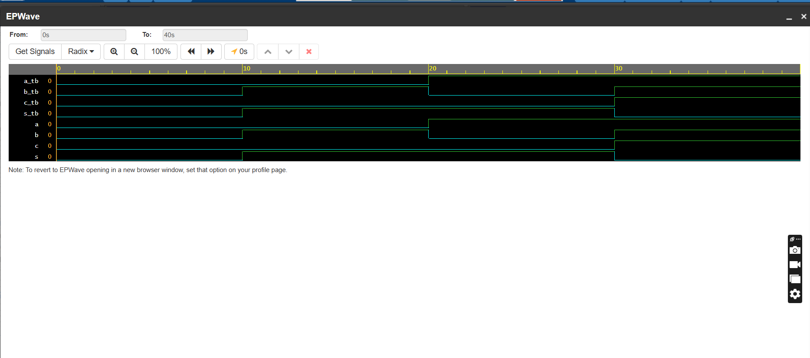
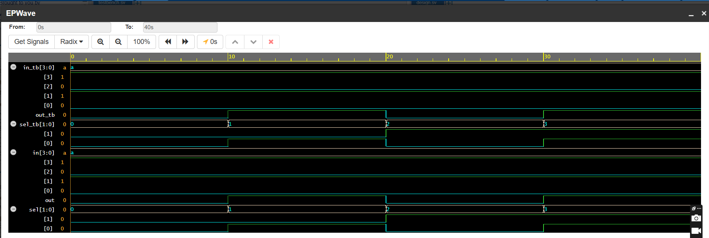
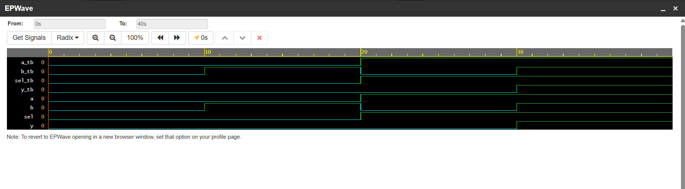
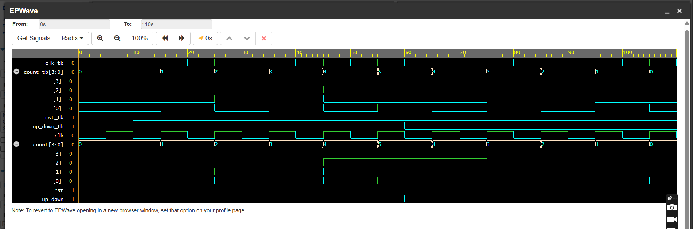

# basic_verilog_codes_with_waveform

---

## ① Half Adder

**Files:** `half_adder.v`, `tb_half_adder.v`  
A simple digital circuit that performs the addition of two binary bits.

### ⬇️ Waveform Output



---

## ② 4:1 Multiplexer

**Files:** `mux_4to1.v`, `tb_mux_4to1.v`  
Implements a 4-to-1 multiplexer using a `case` statement.

### ⬇️ Waveform Output



---

## ③ a) 2:1 MUX and  


**Files:** `mux_2to1_dff.v`, `tb_mux_2to1_dff.v`  
Implements a MUX-controlled D Flip-Flop that updates output on the rising edge of the clock.

### ⬇️ Waveform Output



---
## ③ b) D Flip-Flop with Clock Control

**Files:** `mux_dff.v`, `tb_mux_dff.v`  
Implements a MUX-controlled D Flip-Flop that updates output on the rising edge of the clock.

### ⬇️ Waveform Output


## ④ 4-bit Up/Down Counter

**Files:** `up_down_counter.v`, `tb_up_down_counter.v`  
Counts up or down based on a control signal. Includes synchronous reset.

### ⬇️ Waveform Output



---

## ▶️ Simulation Instructions

### Requirements
- Icarus Verilog
- GTKWave

### Example Compilation and Simulation:
```bash
iverilog -o half_adder.out tb_half_adder.v half_adder.v
vvp half_adder.out
gtkwave dump.vcd
